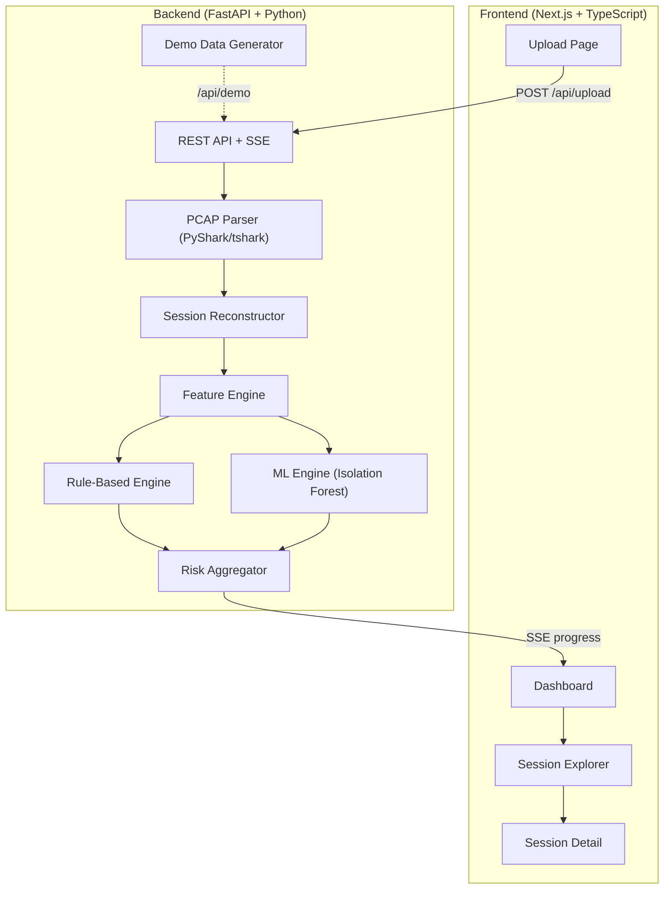
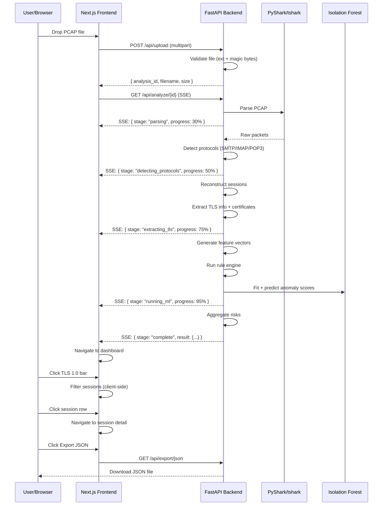

# SecureMailScope — Phase 1 MVP Implementation Plan

## Goal

Build a **passive email cryptographic forensics tool** that lets a security analyst upload a PCAP file and receive a structured, interactive security assessment of all email-related TLS sessions found in the capture. The system uses a **hybrid rule-based + ML anomaly detection** engine to produce risk scores.

**Stack:** FastAPI (Python) backend + Next.js (React/TypeScript) frontend  
**Key Dependency:** tshark/Wireshark (via PyShark) for PCAP dissection

---

## User Review Required

> [!IMPORTANT]
> **Wireshark/tshark is NOT currently installed.** The plan includes installation instructions. tshark is the core dependency — without it, PyShark cannot parse PCAPs.

> [!IMPORTANT]
> **Demo mode included.** A synthetic data generator will let you develop and demo the full UI/pipeline without needing a real PCAP file. The demo dataset simulates 37 email sessions with realistic TLS variations.

> [!WARNING]
> **TLS 1.3 limitation:** TLS 1.3 encrypts certificates during the handshake. PyShark can only extract certificate details from TLS 1.2 and below unless an `SSLKEYLOGFILE` is provided. This is a fundamental protocol limitation, not a tool bug. The dashboard will clearly indicate when certificate data is unavailable.

---

## Open Questions

> [!IMPORTANT]
> **Deployment target:** Is this for local development only, or should we plan for Docker/deployment from the start? The plan currently assumes local dev with `npm run dev` + `uvicorn`.

> [!NOTE]
> **Database:** Phase 1 uses in-memory storage per analysis session (no persistent DB). Analysis results can be exported as JSON/HTML. Should we add SQLite persistence now, or defer to Phase 2?

---

## Architecture Overview



---

## Project Structure

```text
SecureMail/
├── backend/
│   ├── app/
│   │   ├── __init__.py
│   │   ├── main.py                    # FastAPI app, CORS, routes
│   │   ├── config.py                  # Settings, constants
│   │   ├── models/
│   │   │   ├── __init__.py
│   │   │   ├── schemas.py             # Pydantic models (Session, Finding, etc.)
│   │   │   └── enums.py               # Risk levels, protocols, TLS versions
│   │   ├── services/
│   │   │   ├── __init__.py
│   │   │   ├── pcap_parser.py         # PyShark PCAP parsing
│   │   │   ├── session_reconstructor.py # TCP session reconstruction
│   │   │   ├── tls_extractor.py       # TLS handshake/cert extraction
│   │   │   ├── feature_engine.py      # Feature vector generation
│   │   │   ├── rule_engine.py         # Rule-based security scoring
│   │   │   ├── ml_engine.py           # Isolation Forest anomaly detection
│   │   │   ├── risk_aggregator.py     # Hybrid score computation
│   │   │   ├── demo_generator.py      # Synthetic demo data
│   │   │   └── export_service.py      # JSON/HTML export
│   │   └── routers/
│   │       ├── __init__.py
│   │       ├── analysis.py            # /api/upload, /api/analyze, /api/demo
│   │       ├── sessions.py            # /api/sessions, /api/sessions/{id}
│   │       └── export.py              # /api/export/json, /api/export/html
│   ├── requirements.txt
│   ├── tests/
│   │   ├── test_rule_engine.py
│   │   ├── test_ml_engine.py
│   │   ├── test_feature_engine.py
│   │   └── test_demo_generator.py
│   └── uploads/                       # Temp PCAP storage (gitignored)
│
├── frontend/
│   ├── src/
│   │   ├── app/
│   │   │   ├── layout.tsx             # Root layout, fonts, metadata
│   │   │   ├── page.tsx               # Upload page (home)
│   │   │   ├── globals.css            # Design system, CSS variables
│   │   │   └── analysis/
│   │   │       └── [id]/
│   │   │           ├── page.tsx        # Main dashboard
│   │   │           └── session/
│   │   │               └── [sessionId]/
│   │   │                   └── page.tsx # Session detail
│   │   ├── components/
│   │   │   ├── ui/
│   │   │   │   ├── Card.tsx
│   │   │   │   ├── Badge.tsx
│   │   │   │   ├── Button.tsx
│   │   │   │   ├── ProgressBar.tsx
│   │   │   │   ├── FilterChip.tsx
│   │   │   │   └── BarChart.tsx
│   │   │   ├── upload/
│   │   │   │   ├── DropZone.tsx
│   │   │   │   ├── FileInfo.tsx
│   │   │   │   └── AnalysisProgress.tsx
│   │   │   ├── dashboard/
│   │   │   │   ├── SecurityPosture.tsx
│   │   │   │   ├── TLSVersionChart.tsx
│   │   │   │   ├── ProtocolBreakdown.tsx
│   │   │   │   ├── TransportMode.tsx
│   │   │   │   ├── FindingsSummary.tsx
│   │   │   │   └── QuickFilters.tsx
│   │   │   ├── sessions/
│   │   │   │   ├── SessionTable.tsx
│   │   │   │   ├── SessionFilters.tsx
│   │   │   │   └── SessionRow.tsx
│   │   │   └── detail/
│   │   │       ├── SessionHeader.tsx
│   │   │       ├── TLSInfo.tsx
│   │   │       ├── CertificateInfo.tsx
│   │   │       ├── StarttlsTimeline.tsx
│   │   │       ├── RiskBreakdown.tsx
│   │   │       └── RawFindings.tsx
│   │   ├── lib/
│   │   │   ├── api.ts                 # API client
│   │   │   ├── types.ts              # TypeScript types matching backend schemas
│   │   │   └── constants.ts          # Color maps, TLS version names, etc.
│   │   └── hooks/
│   │       ├── useAnalysis.ts         # SSE hook for analysis progress
│   │       └── useFilters.ts          # Filter state management
│   ├── public/
│   │   └── favicon.svg
│   ├── package.json
│   ├── tsconfig.json
│   └── next.config.js
│
├── .gitignore
└── README.md
```

---

## Proposed Changes

### Component 1: Prerequisites & Project Setup

#### [NEW] `.gitignore`

```gitignore
# Python
__pycache__/
*.pyc
*.pyo
.venv/
venv/
*.egg-info/

# Node
node_modules/
.next/
out/

# Uploads
backend/uploads/*
!backend/uploads/.gitkeep

# Environment
.env
.env.local

# IDE
.vscode/
.idea/

# Graphify
graphify-out/

# OS
Thumbs.db
.DS_Store
```

#### [NEW] `README.md`

Installation instructions including:
1. **Wireshark/tshark installation** — Download from [wireshark.org](https://www.wireshark.org/download.html), ensure "Install TShark" is checked during setup, add to PATH
2. Python 3.11+ setup with `pip install -r requirements.txt`
3. Node.js 18+ setup with `npm install`
4. How to run both servers

---

### Component 2: Backend — Core Models

#### [NEW] `backend/app/models/enums.py`

```python
from enum import Enum

class Protocol(str, Enum):
    SMTP = "SMTP"
    IMAP = "IMAP"
    POP3 = "POP3"
    UNKNOWN = "UNKNOWN"

class TLSVersion(str, Enum):
    TLS_1_0 = "TLS 1.0"
    TLS_1_1 = "TLS 1.1"
    TLS_1_2 = "TLS 1.2"
    TLS_1_3 = "TLS 1.3"
    SSL_3_0 = "SSL 3.0"
    NONE = "None"

class TransportMode(str, Enum):
    IMPLICIT_TLS = "Implicit TLS"
    STARTTLS = "STARTTLS"
    PLAINTEXT = "Plaintext"

class RiskLevel(str, Enum):
    CRITICAL = "Critical"
    HIGH = "High"
    MEDIUM = "Medium"
    LOW = "Low"
    INFO = "Info"

class CertificateStatus(str, Enum):
    VALID = "Valid"
    EXPIRED = "Expired"
    SELF_SIGNED = "Self-signed"
    HOSTNAME_MISMATCH = "Hostname mismatch"
    UNAVAILABLE = "Unavailable"  # TLS 1.3 without keylog
```

#### [NEW] `backend/app/models/schemas.py`

Pydantic models covering:

```python
class CertificateInfo(BaseModel):
    subject: str | None
    issuer: str | None
    not_before: str | None
    not_after: str | None
    public_key_algorithm: str | None
    public_key_size: int | None
    signature_algorithm: str | None
    san: list[str]
    status: list[CertificateStatus]

class SessionInfo(BaseModel):
    session_id: str                    # "SES-0001"
    protocol: Protocol
    transport_mode: TransportMode
    source_ip: str
    source_port: int
    dest_ip: str
    dest_port: int
    tls_version: TLSVersion
    cipher_suite: str | None
    key_exchange: str | None
    forward_secrecy: bool
    certificate: CertificateInfo | None
    starttls_timeline: list[str]       # Timeline steps
    packet_count: int
    session_duration_ms: float
    retransmission_count: int
    # Scores
    rule_score: int                    # 0-100 (higher = more risk)
    ml_anomaly_score: float            # 0.0 - 1.0
    risk_level: RiskLevel
    findings: list[Finding]

class AnalysisResult(BaseModel):
    analysis_id: str
    filename: str
    file_size_bytes: int
    total_packets: int
    total_sessions: int
    total_findings: int
    security_posture: int              # 0-100 (higher = better)
    sessions: list[SessionInfo]
    tls_version_distribution: dict[str, int]
    protocol_distribution: dict[str, int]
    transport_mode_distribution: dict[str, int]
    risk_distribution: dict[str, int]
    completed_at: str

class Finding(BaseModel):
    finding_id: str
    session_id: str
    severity: RiskLevel
    title: str
    description: str
    recommendation: str
```

---

### Component 3: Backend — PCAP Parsing Pipeline

#### [NEW] `backend/app/services/pcap_parser.py`

The core parser using PyShark:

```python
import pyshark

async def parse_pcap(filepath: str, progress_callback) -> dict:
    """Parse PCAP file and extract raw packet data."""
    cap = pyshark.FileCapture(
        filepath,
        keep_packets=False,  # Memory efficient for large files
    )
    
    packets = []
    email_ports = {25, 110, 143, 465, 587, 993, 995}
    
    for i, pkt in enumerate(cap):
        if hasattr(pkt, 'tcp'):
            src_port = int(pkt.tcp.srcport)
            dst_port = int(pkt.tcp.dstport)
            if src_port in email_ports or dst_port in email_ports:
                packets.append(extract_packet_info(pkt))
        
        if i % 500 == 0:
            await progress_callback("parsing", i)
    
    cap.close()
    return {"packets": packets, "total_scanned": i + 1}
```

Key design decisions:
- **Filter by email ports** (25, 110, 143, 465, 587, 993, 995) to focus on relevant traffic
- `keep_packets=False` to avoid memory exhaustion on large PCAPs
- Progress callback for SSE streaming to frontend

#### [NEW] `backend/app/services/session_reconstructor.py`

Groups packets into TCP sessions using the 5-tuple `(src_ip, src_port, dst_ip, dst_port, protocol)`:

```python
def reconstruct_sessions(packets: list[dict]) -> list[dict]:
    """Group packets into logical email sessions."""
    sessions = {}
    
    for pkt in packets:
        # Generate session key from TCP stream index or 5-tuple
        session_key = generate_session_key(pkt)
        
        if session_key not in sessions:
            sessions[session_key] = {
                "packets": [],
                "protocol": detect_email_protocol(pkt),
                "transport_mode": TransportMode.PLAINTEXT,
            }
        
        sessions[session_key]["packets"].append(pkt)
        
        # Detect STARTTLS
        if is_starttls_command(pkt):
            sessions[session_key]["transport_mode"] = TransportMode.STARTTLS
    
    return list(sessions.values())
```

#### [NEW] `backend/app/services/tls_extractor.py`

Extracts TLS handshake details from sessions:

```python
def extract_tls_info(session_packets: list[dict]) -> dict:
    """Extract TLS version, cipher suite, certificates from session."""
    tls_info = {
        "tls_version": TLSVersion.NONE,
        "cipher_suite": None,
        "key_exchange": None,
        "forward_secrecy": False,
        "certificate": None,
    }
    
    for pkt in session_packets:
        if pkt.get("tls_handshake_type") == "server_hello":
            tls_info["tls_version"] = map_tls_version(pkt["tls_version"])
            tls_info["cipher_suite"] = pkt.get("cipher_suite")
            tls_info["key_exchange"] = derive_key_exchange(pkt["cipher_suite"])
            tls_info["forward_secrecy"] = check_forward_secrecy(pkt["cipher_suite"])
        
        if pkt.get("tls_handshake_type") == "certificate":
            tls_info["certificate"] = parse_certificate(pkt)
    
    return tls_info
```

Cipher classification logic:

| Cipher Pattern | Key Exchange | Forward Secrecy |
|---|---|---|
| `ECDHE_*` | ECDHE | ✓ |
| `DHE_*` | DHE | ✓ |
| `RSA_*` | RSA | ✗ |
| `*_AES_256_GCM_*` | — | Strong |
| `*_AES_128_GCM_*` | — | Strong |
| `*_3DES_*` | — | Weak |
| `*_RC4_*` | — | Weak |

---

### Component 4: Backend — Hybrid Security Engine

#### [NEW] `backend/app/services/feature_engine.py`

Generates the feature vector for each session:

```python
def extract_features(session: SessionInfo) -> np.ndarray:
    """Convert session to ML feature vector."""
    return np.array([
        tls_version_to_numeric(session.tls_version),      # 0-4
        cipher_strength_score(session.cipher_suite),        # 0-100
        key_exchange_score(session.key_exchange),            # 0-100
        session.certificate.public_key_size if session.certificate else 0,
        1.0 if session.forward_secrecy else 0.0,
        1.0 if is_cert_expired(session.certificate) else 0.0,
        1.0 if is_cert_self_signed(session.certificate) else 0.0,
        1.0 if hostname_matches(session.certificate) else 0.0,
        1.0 if session.transport_mode == TransportMode.STARTTLS else 0.0,
        session.packet_count,
        session.session_duration_ms,
        session.retransmission_count,
    ])
```

#### [NEW] `backend/app/services/rule_engine.py`

Deterministic security scoring:

```python
RULES = [
    # (condition_fn, penalty, title, description, recommendation)
    (lambda s: s.tls_version in [TLSVersion.TLS_1_0, TLSVersion.SSL_3_0],
     30, "Deprecated TLS Version",
     "Session uses {version} which has known vulnerabilities",
     "Upgrade to TLS 1.2 or TLS 1.3"),
    
    (lambda s: s.tls_version == TLSVersion.TLS_1_1,
     15, "Legacy TLS Version",
     "TLS 1.1 is deprecated by RFC 8996",
     "Upgrade to TLS 1.2 or TLS 1.3"),
    
    (lambda s: is_weak_cipher(s.cipher_suite),
     25, "Weak Cipher Suite",
     "Cipher {cipher} is considered cryptographically weak",
     "Use AES-256-GCM or ChaCha20-Poly1305"),
    
    (lambda s: not s.forward_secrecy,
     15, "No Forward Secrecy",
     "RSA key exchange does not provide forward secrecy",
     "Use ECDHE or DHE key exchange"),
    
    (lambda s: is_cert_expired(s),
     20, "Expired Certificate",
     "Server certificate expired on {date}",
     "Renew the certificate immediately"),
    
    (lambda s: is_cert_self_signed(s),
     10, "Self-Signed Certificate",
     "Certificate is not issued by a trusted CA",
     "Use a certificate from a trusted Certificate Authority"),
    
    (lambda s: s.transport_mode == TransportMode.PLAINTEXT,
     35, "Plaintext Connection",
     "Email traffic is completely unencrypted",
     "Enable TLS (STARTTLS or implicit TLS)"),
    
    (lambda s: not hostname_matches(s),
     15, "Hostname Mismatch",
     "Certificate CN/SAN does not match server hostname",
     "Issue certificate with correct hostname"),
]

def evaluate(session: SessionInfo) -> tuple[int, list[Finding]]:
    """Returns (total_penalty, list_of_findings)."""
    total = 0
    findings = []
    for condition, penalty, title, desc, rec in RULES:
        if condition(session):
            total += penalty
            findings.append(Finding(
                severity=penalty_to_severity(penalty),
                title=title,
                description=desc,
                recommendation=rec,
            ))
    return min(total, 100), findings
```

#### [NEW] `backend/app/services/ml_engine.py`

Isolation Forest anomaly detection:

```python
from sklearn.ensemble import IsolationForest
from sklearn.preprocessing import StandardScaler
import numpy as np

class AnomalyDetector:
    def __init__(self):
        self.model = IsolationForest(
            n_estimators=100,
            contamination='auto',
            random_state=42,
        )
        self.scaler = StandardScaler()
        self._fitted = False
    
    def fit_and_predict(self, features: np.ndarray) -> np.ndarray:
        """
        Fit on the capture's sessions and return anomaly scores.
        Score range: 0.0 (normal) to 1.0 (highly anomalous).
        
        Requires at least 5 sessions to produce meaningful results.
        Falls back to 0.5 (neutral) for smaller captures.
        """
        if len(features) < 5:
            return np.full(len(features), 0.5)
        
        scaled = self.scaler.fit_transform(features)
        self.model.fit(scaled)
        self._fitted = True
        
        # Raw scores: negative = anomaly, positive = normal
        raw_scores = self.model.decision_function(scaled)
        
        # Normalize to 0-1 where 1 = most anomalous
        normalized = 1 - (raw_scores - raw_scores.min()) / \
                        (raw_scores.max() - raw_scores.min() + 1e-8)
        
        return normalized
```

> [!NOTE]
> **Why Isolation Forest fits Phase 1:** It's unsupervised (no labeled data needed), works on small datasets (a single PCAP capture), has linear time complexity, and answers a defensible question: *"Is this TLS session behaving unusually compared to the other sessions in this capture?"*

#### [NEW] `backend/app/services/risk_aggregator.py`

Combines rule-based and ML scores:

```python
def aggregate_risk(rule_score: int, ml_anomaly_score: float) -> tuple[int, RiskLevel]:
    """
    Hybrid risk computation.
    
    Formula: combined = 0.7 * rule_score + 0.3 * (ml_anomaly_score * 100)
    
    Rules dominate (70%) because they are deterministic and explainable.
    ML contributes (30%) to surface unusual patterns rules might miss.
    """
    combined = int(0.7 * rule_score + 0.3 * (ml_anomaly_score * 100))
    combined = min(combined, 100)
    
    if combined >= 75:
        return combined, RiskLevel.CRITICAL
    elif combined >= 50:
        return combined, RiskLevel.HIGH
    elif combined >= 25:
        return combined, RiskLevel.MEDIUM
    else:
        return combined, RiskLevel.LOW

def compute_security_posture(sessions: list[SessionInfo]) -> int:
    """Overall security posture: 100 - average risk score."""
    if not sessions:
        return 100
    avg_risk = sum(s.rule_score for s in sessions) / len(sessions)
    return max(0, 100 - int(avg_risk))
```

---

### Component 5: Backend — Demo Data Generator

#### [NEW] `backend/app/services/demo_generator.py`

Generates 37 realistic synthetic sessions covering all edge cases:

```python
def generate_demo_data() -> AnalysisResult:
    """
    Generate a realistic demo dataset simulating enterprise email traffic.
    
    Distribution:
    - 18 TLS 1.3 sessions (all low risk)
    - 14 TLS 1.2 sessions (mix of low/medium)
    - 3 TLS 1.1 sessions (high risk)
    - 2 TLS 1.0 sessions (critical risk)
    
    Protocols: 21 SMTP, 9 IMAP, 7 POP3
    Transport: 12 Implicit TLS, 19 STARTTLS, 6 Plaintext
    
    Includes:
    - Expired certificates (2)
    - Self-signed certificates (1)
    - Hostname mismatches (1)
    - Weak ciphers (4)
    - No forward secrecy (7)
    - ML anomalies (3)
    """
```

This is critical for development — the demo endpoint bypasses PCAP parsing entirely and returns a complete `AnalysisResult` with all fields populated.

---

### Component 6: Backend — API Routes

#### [NEW] `backend/app/routers/analysis.py`

```python
@router.post("/api/upload")
async def upload_pcap(file: UploadFile) -> dict:
    """Upload PCAP file, validate, return analysis_id."""
    # Validate extension (.pcap, .pcapng)
    # Validate magic bytes
    # Save to uploads/ with UUID filename
    # Return { analysis_id, filename, file_size }

@router.get("/api/analyze/{analysis_id}")
async def analyze(analysis_id: str):
    """SSE endpoint streaming analysis progress."""
    # Returns Server-Sent Events:
    # data: {"stage": "parsing", "progress": 42}
    # data: {"stage": "detecting_protocols", "progress": 60}
    # data: {"stage": "extracting_tls", "progress": 75}
    # data: {"stage": "analyzing_certificates", "progress": 85}
    # data: {"stage": "running_anomaly_detection", "progress": 95}
    # data: {"stage": "complete", "result": {...}}

@router.post("/api/demo")
async def demo_analysis() -> AnalysisResult:
    """Generate and return demo data (no PCAP needed)."""
```

#### [NEW] `backend/app/routers/sessions.py`

```python
@router.get("/api/analysis/{id}/sessions")
async def list_sessions(
    id: str,
    protocol: Protocol | None = None,
    tls_version: TLSVersion | None = None,
    transport: TransportMode | None = None,
    risk: RiskLevel | None = None,
    search: str | None = None,
) -> list[SessionInfo]:
    """Filtered session list."""

@router.get("/api/analysis/{id}/sessions/{session_id}")
async def get_session(id: str, session_id: str) -> SessionInfo:
    """Full session detail."""
```

#### [NEW] `backend/app/routers/export.py`

```python
@router.get("/api/analysis/{id}/export/json")
async def export_json(id: str) -> FileResponse:
    """Export full analysis as JSON."""

@router.get("/api/analysis/{id}/export/html")
async def export_html(id: str) -> FileResponse:
    """Export formatted HTML report."""
```

---

### Component 7: Frontend — Design System

#### [NEW] `frontend/src/app/globals.css`

CSS variables implementing the deep blue → teal security gradient:

```css
:root {
  /* Brand gradient: Midnight Navy → Deep Cyan → Teal */
  --gradient-brand: linear-gradient(135deg, #0F172A, #155E75, #0F766E);
  --gradient-subtle: linear-gradient(135deg, #0F172A08, #155E7508);
  
  /* Light mode */
  --bg-primary: #F8FAFC;
  --bg-card: #FFFFFF;
  --text-primary: #0F172A;
  --text-secondary: #64748B;
  --border: #E2E8F0;
  
  /* Severity colors */
  --color-critical: #DC2626;
  --color-high: #EA580C;
  --color-medium: #D97706;
  --color-low: #16A34A;
  --color-info: #2563EB;
  
  /* TLS version colors */
  --tls-1-3: #0F766E;  /* Teal */
  --tls-1-2: #2563EB;  /* Blue */
  --tls-1-1: #EA580C;  /* Orange */
  --tls-1-0: #DC2626;  /* Red */
  
  /* Typography */
  --font-sans: 'Inter', system-ui, sans-serif;
  --font-mono: 'JetBrains Mono', monospace;
  
  /* Spacing */
  --radius: 12px;
  --radius-sm: 8px;
}

/* Dark mode */
@media (prefers-color-scheme: dark) {
  :root {
    --bg-primary: #07111F;
    --bg-card: #0B1727;
    --text-primary: #E2E8F0;
    --text-secondary: #94A3B8;
    --border: #1E293B;
  }
}
```

Typography: **Inter** (body), **JetBrains Mono** (code/technical data)

---

### Component 8: Frontend — Upload Page (Screen 1)

#### [NEW] `frontend/src/app/page.tsx`

The landing page with:

1. **Hero section** — Gradient background with "SECUREMAILSCOPE" branding and "Passive Email Cryptographic Forensics" tagline
2. **Drop zone** — Large centered area with drag-and-drop + file browse, subtle gradient border animation
3. **File validation** — Client-side .pcap/.pcapng check before upload
4. **File info** — After upload: filename, size, packet count estimate
5. **Start Analysis button** — Primary gradient button
6. **Analysis progress** — Animated progress bar with stage indicators:
   - Parsing PCAP
   - Detecting protocols
   - Reconstructing sessions
   - Extracting TLS
   - Analyzing certificates
   - Running anomaly detection
7. **Demo mode button** — Secondary button "Try with Demo Data" for instant demo

The progress uses SSE (`EventSource`) to stream real-time updates from the backend.

---

### Component 9: Frontend — Dashboard (Screen 2)

#### [NEW] `frontend/src/app/analysis/[id]/page.tsx`

Top-level layout:

```text
┌─ Sidebar ─────────────────┐┌─ Main Content ────────────────────────┐
│ ◉ SecureMailScope         ││ Analysis: filename.pcap               │
│                           ││ 8,421 packets • 37 sessions           │
│ Overview        ← active  ││                                       │
│ Sessions                  ││ ┌──────┐ ┌──────┐ ┌──────┐           │
│ Findings                  ││ │68/100│ │  37  │ │  12  │           │
│ Certificates              ││ │Score │ │Sesns │ │Finds │           │
│                           ││ └──────┘ └──────┘ └──────┘           │
│ ─────────────             ││                                       │
│ Export JSON               ││ TLS VERSION DISTRIBUTION              │
│ Export HTML               ││ ████████████████████                  │
│                           ││                                       │
│                           ││ PROTOCOLS    TRANSPORT MODE            │
│                           ││ ████████     ████████████             │
│                           ││                                       │
│                           ││ QUICK FILTERS                         │
│                           ││ [TLS 1.0: 2] [Expired: 2] [Weak: 4] │
│                           ││                                       │
│                           ││ SESSION EXPLORER (table)              │
│                           ││ ████████████████████████              │
└───────────────────────────┘└──────────────────────────────────────┘
```

Key components:

- **SecurityPosture** — Circular gauge showing 0-100 score with gradient color
- **TLSVersionChart** — Horizontal bar chart, each bar colored by TLS version, clickable to filter
- **ProtocolBreakdown** — SMTP/IMAP/POP3 counts with icons
- **TransportMode** — Implicit TLS / STARTTLS / Plaintext distribution
- **QuickFilters** — Chip-style filter buttons: `[TLS 1.0: 2]` `[Expired Certs: 2]` `[Weak Ciphers: 4]` `[No Forward Secrecy: 7]` `[Anomalies: 3]`
- **SessionTable** — Main data table with sortable columns and risk-colored rows

Clicking TLS bars or filter chips updates `useFilters` state which filters the session table.

---

### Component 10: Frontend — Session Explorer (Screen 3)

Part of the dashboard page but deserves detailed spec:

#### [NEW] `frontend/src/components/sessions/SessionTable.tsx`

| Column | Data | Sortable |
|---|---|---|
| Protocol | SMTP / IMAP / POP3 | ✓ |
| Source | IP:port | ✓ |
| Destination | IP:port | ✓ |
| TLS Version | Badge colored by version | ✓ |
| Cipher | Truncated cipher name | ✗ |
| Forward Secrecy | ✓/✗ icon | ✓ |
| Risk | Badge with severity color | ✓ |

#### [NEW] `frontend/src/components/sessions/SessionFilters.tsx`

Dropdown filters:
- **Protocol:** All / SMTP / IMAP / POP3
- **TLS Version:** All / TLS 1.3 / TLS 1.2 / TLS 1.1 / TLS 1.0
- **Transport:** All / Implicit TLS / STARTTLS / Plaintext
- **Risk:** All / Critical / High / Medium / Low
- **Certificate:** All / Valid / Expired / Self-signed / Hostname mismatch
- **Forward Secrecy:** All / Yes / No
- **Search:** Text search by host / IP / session ID

---

### Component 11: Frontend — Session Detail (Screen 4)

#### [NEW] `frontend/src/app/analysis/[id]/session/[sessionId]/page.tsx`

Full session view with these sections:

1. **Session Header** — Protocol, source → destination, session ID
2. **Connection Info** — Client IP:port, Server IP:port, Protocol, Transport mode
3. **TLS Info** — Version (badge), Cipher suite, Key exchange, Forward secrecy (✓/✗)
4. **STARTTLS Timeline** — Vertical timeline visualization:
   ```
   ● SMTP Connection
   │
   ● EHLO
   │
   ● STARTTLS advertised
   │
   ● STARTTLS requested
   │
   ● TLS Handshake
   │
   ● Encrypted session
   ```
5. **Certificate Info** — Subject, issuer, validity dates, public key, signature algorithm, SANs, status badges (✓ Valid / ⚠ Expired / ⚠ Hostname mismatch)
6. **Risk Breakdown** — Risk score gauge, rule findings table, ML anomaly score bar, confidence percentage
7. **Raw Findings** — Table of all findings with severity, title, description, recommendation

---

### Component 12: Frontend — Export

#### [NEW] `frontend/src/components/dashboard/ExportButtons.tsx`

- **Export JSON** — Downloads complete analysis result as formatted JSON matching the schema in spec section 11
- **Export HTML** — Downloads a self-contained HTML report with inline CSS, all charts rendered as tables/bars

---

## Data Flow — End-to-End Sequence



---

## Design Decisions & Rationale

### Why PyShark over Scapy?
- PyShark wraps **tshark**, giving access to Wireshark's 3000+ protocol dissectors
- Native TLS handshake parsing without manual implementation
- Certificate extraction is built-in
- STARTTLS detection works across SMTP/IMAP/POP3
- **Tradeoff:** Requires tshark installation, slightly slower than raw Scapy

### Why Isolation Forest for ML?
- **Unsupervised** — No labeled data needed; works on a single PCAP capture
- **Small datasets** — Works well with even 10-50 sessions
- **Interpretable** — Anomaly scores map directly to "how unusual is this session"
- **Fast** — Linear time complexity, fits and predicts in <1 second
- **Defensible** — Answers "is this session unusual compared to peers" not "is this an attack"

### Why 70/30 rule/ML split?
- Rules are **deterministic and explainable** — a deprecated TLS version is always bad
- ML catches **patterns rules miss** — unusual handshake timing, odd retransmission patterns
- 70/30 ensures rule violations dominate (as they should) while ML provides supplementary signal

### Why SSE over WebSockets?
- Analysis progress is **one-directional** (server → client)
- SSE has native `EventSource` browser support with auto-reconnect
- Simpler implementation than WebSocket for this use case

---

## Verification Plan

### Automated Tests

```bash
# Backend tests
cd backend
pip install -r requirements.txt
pip install pytest pytest-asyncio httpx
pytest tests/ -v

# Frontend lint/type-check
cd frontend
npm install
npm run lint
npx tsc --noEmit
```

Key test cases:

| Test | What it verifies |
|---|---|
| `test_rule_engine.py` | All 8 rules fire correctly; penalties sum properly; edge cases (max 100) |
| `test_ml_engine.py` | Anomaly scores in [0,1]; <5 sessions returns 0.5; deterministic with seed |
| `test_feature_engine.py` | Feature vector has correct dimensionality; handles missing cert gracefully |
| `test_demo_generator.py` | Demo returns valid AnalysisResult; all sessions have required fields |
| `test_risk_aggregator.py` | Combined score follows 70/30 formula; severity thresholds correct |

### Manual Verification

1. **Demo mode flow:** Click "Try with Demo Data" → dashboard renders → TLS chart is clickable → filter chips work → session detail shows all sections → export produces valid JSON
2. **Dark mode:** Toggle system theme → all colors swap correctly
3. **Responsive:** Resize browser → dashboard adapts (sidebar collapses on mobile)
4. **Real PCAP (after tshark install):** Upload a small email capture → parsing progress streams → results appear

---

## Implementation Order

| Step | Component | Est. Time | Dependencies |
|---|---|---|---|
| 1 | Project scaffolding (Next.js + FastAPI) | 20 min | None |
| 2 | Backend models (enums, schemas) | 15 min | Step 1 |
| 3 | Demo data generator | 30 min | Step 2 |
| 4 | Backend API routes (upload, demo, SSE) | 30 min | Step 2-3 |
| 5 | Frontend design system (globals.css) | 20 min | Step 1 |
| 6 | Upload page with drop zone + progress | 40 min | Step 4-5 |
| 7 | Dashboard overview components | 45 min | Step 5-6 |
| 8 | Session explorer + filters | 40 min | Step 7 |
| 9 | Session detail page | 40 min | Step 8 |
| 10 | Rule engine | 25 min | Step 2 |
| 11 | ML engine (Isolation Forest) | 25 min | Step 2 |
| 12 | Risk aggregator | 15 min | Step 10-11 |
| 13 | Feature engine | 20 min | Step 2 |
| 14 | PCAP parser + session reconstruction | 45 min | Step 2 |
| 15 | TLS extractor | 30 min | Step 14 |
| 16 | Connect real parser pipeline | 20 min | Step 10-15 |
| 17 | Export (JSON + HTML) | 20 min | Step 4 |
| 18 | Polish: animations, dark mode, responsive | 30 min | Step 6-9 |
| 19 | Tests | 30 min | Step 10-16 |
| 20 | README + tshark install guide | 15 min | All |

**Total estimated: ~8-9 hours of implementation**

The plan builds demo mode first (steps 1-9) so you can iterate on the UI without needing tshark, then adds the real analysis pipeline (steps 10-16), then polishes and tests.

---

## Wireshark/tshark Installation (Windows)

Since tshark is not currently installed:

1. Download Wireshark from [wireshark.org/download.html](https://www.wireshark.org/download.html)
2. During installation, ensure **"Install TShark"** is checked
3. Add to PATH: `C:\Program Files\Wireshark` (or wherever installed)
4. Verify: `tshark --version` in PowerShell

> [!TIP]
> tshark is only needed for **real PCAP parsing**. The demo mode works without it. You can install tshark later and develop the full UI now.
